# chipo-web

[](https://opensource.org/licenses/MIT)
[](https://opensource.org/licenses/Apache-2.0)
[](https://travis-ci.org/jeffrey-xiao/chipo-web)

A web interface to [`chipo-rs`](https://gitlab.com/jeffrey-xiao/chipo-rs).

The keypad layout is modified for ease of use on modern keyboards:

```
1 2 3 C  →  1 2 3 4
4 5 6 D  →  Q W E R
7 8 9 E  →  A S D F
A 0 B F  →  Z X C V
```

## Screenshots


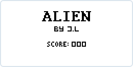
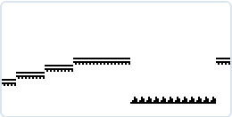

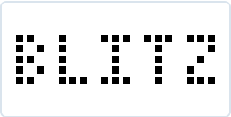
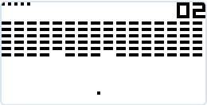


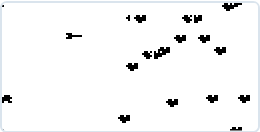

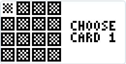
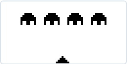


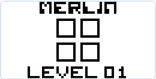


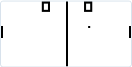
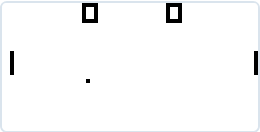
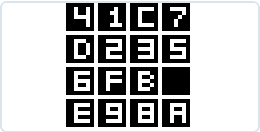


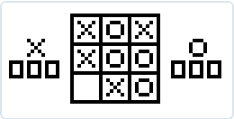
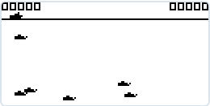


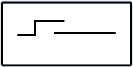

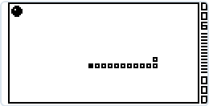

## License

`chipo-web` is distributed under the terms of both the MIT License and the Apache License (Version
2.0).

See [LICENSE-APACHE](LICENSE-APACHE) and [LICENSE-MIT](LICENSE-MIT) for more details.
